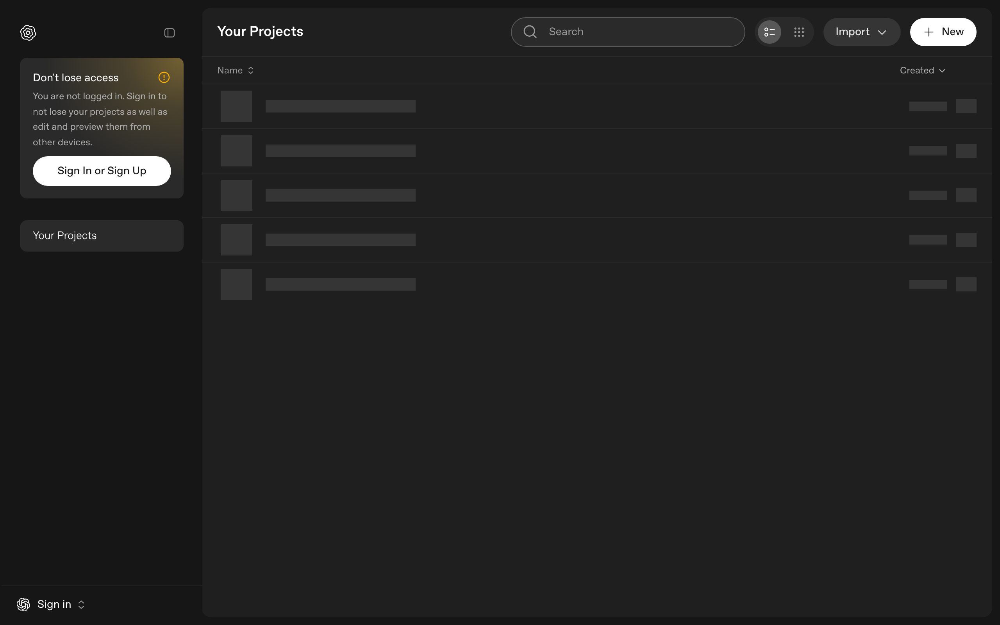

# Prism — OpenAI's LaTeX Editor

> OpenAI built a full LaTeX editor. Write papers with AI help, right in your browser.

**Link**: [prism.openai.com](https://prism.openai.com/)
**Pricing**: Free · Pro at $7/mo

## What it is

LaTeX editor that runs in your browser. AI helps you write and edit. Compiles to PDF in real time. No local LaTeX install needed. Used to be called Crixet before OpenAI picked it up.

## Cool bits

- Voice mode — talk your edits instead of typing
- Zotero sync for bibliographies
- Collab editing with co-authors
- Version snapshots so you can roll back

## Why care

OpenAI is quietly shipping actual tools now, not just APIs. If you write academic papers and hate wrestling with LaTeX setup, this is worth 5 minutes of your time.
